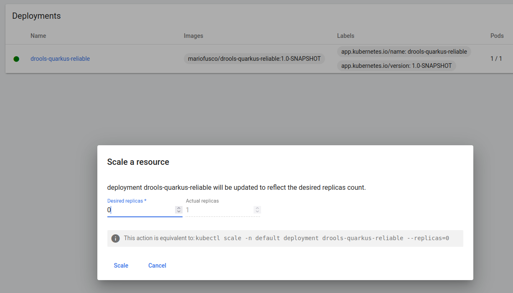

# Quarkus + Drools Reliable Session

## Description

A simple rule service to validate `LoanApplication` fact and get the total amount of approved loans in a reliable stateful session. In other words the state of a session is persisted across different executions, so if the server is shut down and then restarted the state of an old session is not lost. This demo persists the state of a session using infinispan running in embedded mode, but other persistence options will be made available in future.

## Installing and Running 

### Prerequisites

You will need:
  - Java 11+ installed
  - Environment variable JAVA_HOME set accordingly
  - Maven 3.8.6+ installed

### Package and Run in JVM mode

```sh
mvn clean package
java -jar target/quarkus-app/quarkus-run.jar
```

## Example Usage

### POST /session

Create a new drools session returning its id.

```sh
curl -X POST -H 'Accept: application/json' -H 'Content-Type: application/json' http://localhost:8080/session
```

This call simply returns a number that is the id of the newly created session. It will be necessary to use the same id for all the subsequent calls to this session.

### POST /session/{sessionId}/find-approved-amount

Insert a list of loan applications and returns the total amount of applications approved so far in that session. For instance sending to a newly created session the following payload.

```sh
curl -X POST -H 'Accept: application/json' -H 'Content-Type: application/json' -d '{"maxAmount":5000,"loanApplications":[{"id":"ABC10001","amount":2000,"deposit":100,"applicant":{"age":45,"name":"John"}}, {"id":"ABC10002","amount":5000,"deposit":100,"applicant":{"age":25,"name":"Paul"}}, {"id":"ABC10015","amount":1000,"deposit":100,"applicant":{"age":12,"name":"George"}}]}' http://localhost:8080/session/0/find-approved-amount
```

will produce the following output

```json
{"sessionId":0,"approvedApplicationsAmount":2000}
```

since, given the current set of business rules, only the first of the 3 applications sent above can be approved.

Sending the same payload a second time to the same session will produce a response like

```json
{"sessionId":0,"approvedApplicationsAmount":4000}
```

because another application that worth 2000 has been approved and then the total amount of the loan applications approved so far in this session is 4000. Note that, due to the reliable nature of the session, the same result will be returned even if the Quarkus server has been killed and then restarted between these 2 invocations.

## Installing and Running on Minikube

This new capability for a Drools `KieSession` of being reliable makes it a perfect fit for a cloud environment where a node hosting a long running stateful computation could suddenly die for many different reasons. When this happens another node can be started without losing any data of the old session and keeping using it as nothing happened.

To run this project inside minikube it is necessary to follow these steps:

1. Start your local instance of minikube with

```sh
minikube start
```

2. Build this project.

```sh
mvn clean package
```

3. Push the project image into your minikube cluster with a command like.  

```sh
minikube image load mariofusco/drools-quarkus-reliable:1.0-SNAPSHOT
```

4. Mount a directory from the host into the guest using an explicit UID e GID. This is necessary because minikube doesn't grant the right write permission by default as reported [here](https://stackoverflow.com/questions/60479594/minikube-volume-write-permissions#comment133955675_60498848).

```sh
minikube mount $(pwd)/minikubetmp:/mnt/data --uid 185 --gid 0
```

5. Apply the automatically generated yaml configuration

```sh
kubectl apply -f target/kubernetes/kubernetes.yml
```

6. Use minikube tunnel to creates a route to the deployed service with type LoadBalancer.

```sh
minikube tunnel
```

7. Discover the IP address assigned by minikube tunnel to this newly created route with

```sh
kubectl get service
```

This should produce an output similar to the following

```
NAME                      TYPE           CLUSTER-IP      EXTERNAL-IP     PORT(S)        AGE
drools-quarkus-reliable   LoadBalancer   10.110.16.144   10.110.16.144   80:31172/TCP   44s
kubernetes                ClusterIP      10.96.0.1       <none>          443/TCP        11d
```

meaning that the service is now ready to reply on the `80` port of the address `10.110.16.144`.

8. The service can now be used invoking the same rest endpoints of the local application, paying only attention to replace localhost with the IP address mapped by minikube tunnel, so it is possible to create a reliable session calling:

```sh
curl -X POST -H 'Accept: application/json' -H 'Content-Type: application/json' http://10.110.16.144:80/session
```

and evaluate loan applications on that session with something like:

```sh
curl -X POST -H 'Accept: application/json' -H 'Content-Type: application/json' -d '{"maxAmount":5000,"loanApplications":[{"id":"ABC10001","amount":2000,"deposit":100,"applicant":{"age":45,"name":"John"}}, {"id":"ABC10002","amount":5000,"deposit":100,"applicant":{"age":25,"name":"Paul"}}, {"id":"ABC10015","amount":1000,"deposit":100,"applicant":{"age":12,"name":"George"}}]}' http://http://10.110.16.144:80/session/0/find-approved-amount
```

9. From the minikube dashboard it is now also possible to scale to zero the deployment running this application. 



Trying to do so of course the application won't respond anymore to any further rest invocation, but scaling it up to one again the reliable session will automatically restore its state and the computation can continue as nothing happened.